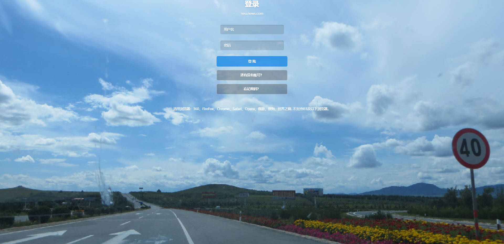
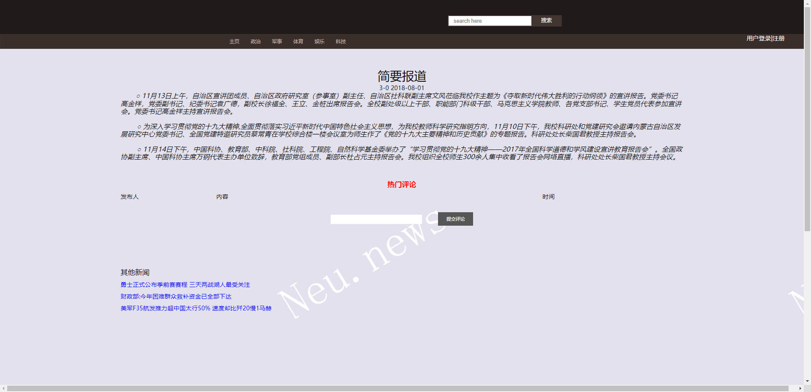
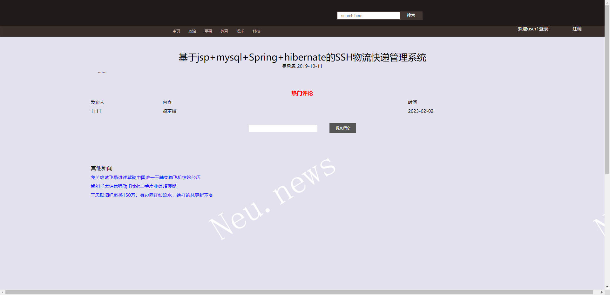
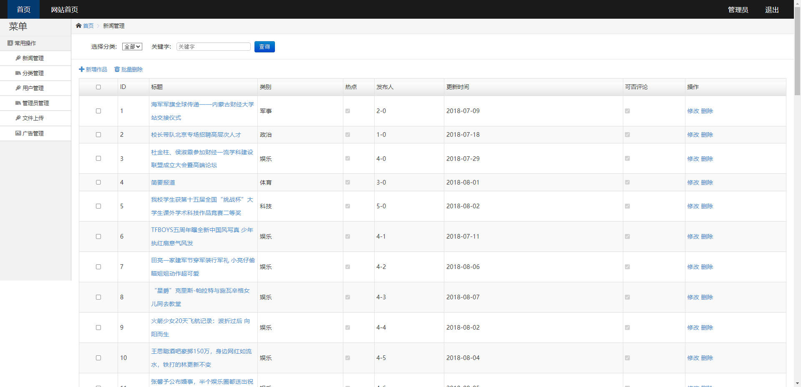
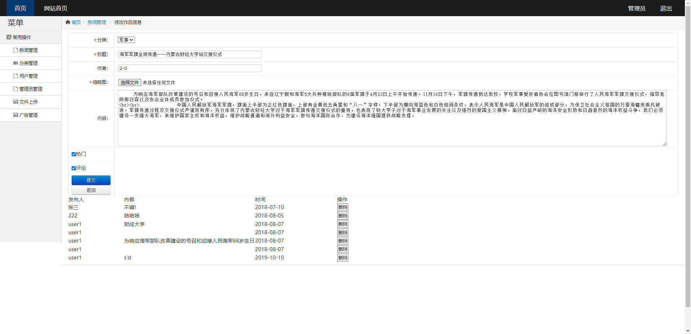
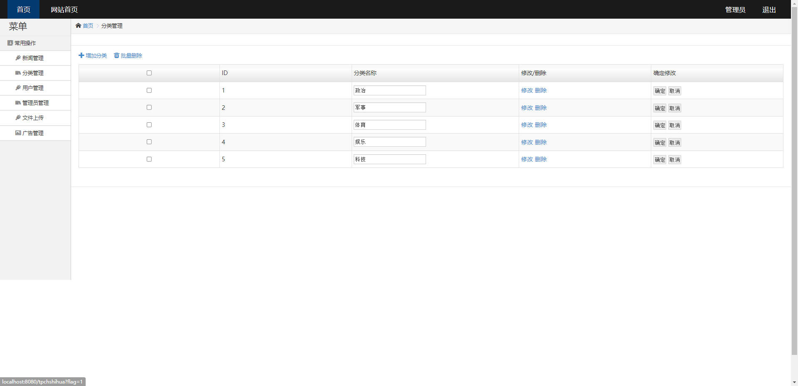
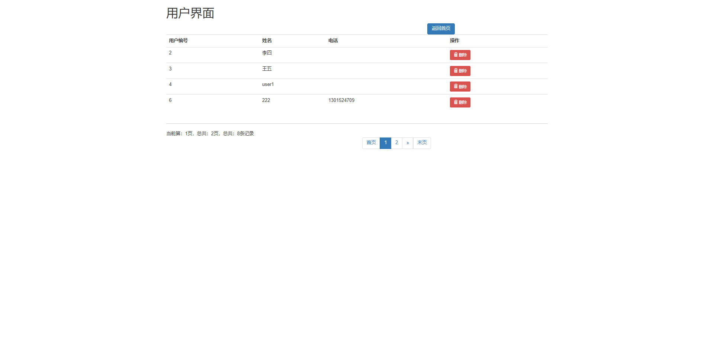
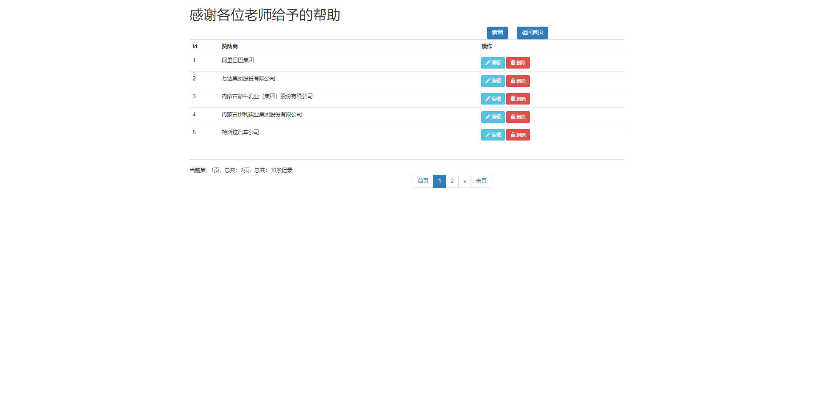

# 基于SSM的新闻管理系统

# SSM-026

### 技术栈

ssm mybatis jsp

## 数据库

mysql (7张表)


## 运行截图

### 前台

### 

### 后台









### 

## 需要看运行视频或源码

```html
见images目录下面的a.txt文件
```


## 访问网址

### 前台

```
http://localhost:8080/index.jsp

账号 学号1
密码 123456
```

### 后台

```
http://localhost:8080/houtai/index.jsp#

账号 admin
密码 123456
```
